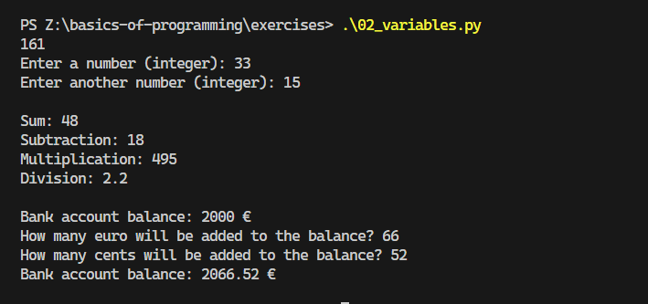
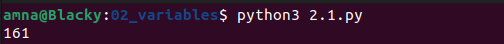
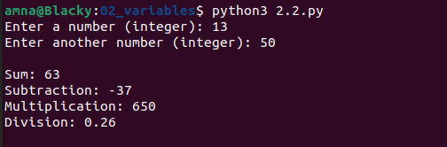
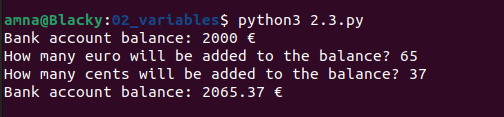

# Basics of Programming

## Exercises 2: Variables
* Information on how to return exercises is in course Moodle page.

### 2.1.
Create a program that declares a variable that stores persons height in full centimeters. Print the value of the variable into the console.

### 2.2.
Create a program that asks two integer numbers from the user and prints result of their their:
* Sum
* Subtraction
* Multipication
* Division

Example output:

    Enter a number: 120
    Enter another number: 5
    Sum: 125
    Subtraction: 115
    Multipication: 600
    Division: 24.0

### 2.3.
Declare a variable which is used to store bank account balance in euro (start balance of 2000 €). Print current balance into the console. Ask from user how many euro will be added to the balance. Then ask how many cents are added to the balance. Print the balance after user requested changes are made.

Example output:

    Bank account balance: 2000 €
    How many euros will be added to the balance? 120
    How many cents will be added to the balance? 55
    Bank account balance: 2120.55 €

# NOTES
- Floating points use more memory and are slow to calculate
- `balance = blanace + deposit` is the same as `balance += deposit`