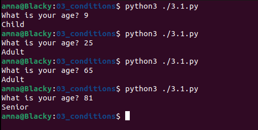
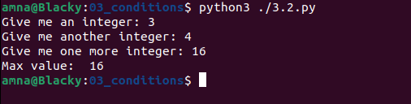
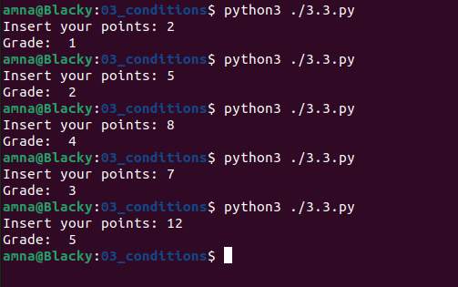
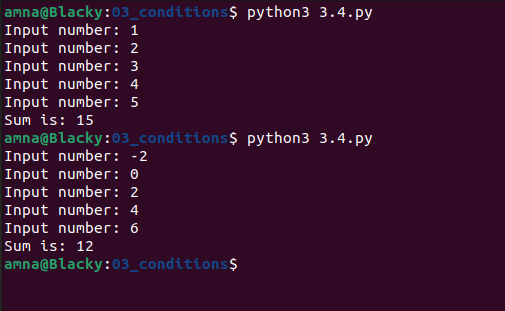

# Basics of Programming

## Exercises 3: Conditions
* Information on how to return exercises is in course Moodle page.

### 3.1.
Make a program that asks the user his/her age.
* if the age is less than 13 years, print "*child*"
* if the age is 13-19 years, print "*teen*"
* if it is 20-65 years old, print "*adult*"
* otherwise print "*senior*".

### 3.2.
Make a program that asks the user for 3 integers and prints the largest of them.

Example output:

    Input integer: 2
    Input another integer: 3
    One more: 1
    Max value: 3

### 3.3.
Make a program that gives the student a grade according to the table below.
Ask for a points on the console and print the grade.

| points | grade |
|:--------|:----------:|
| 0-1 | 0 |
| 2-3 | 1 |
| 4-5 | 2 |
| 6-7 | 3 |
| 8-9 | 4 |
| 10-12 | 5 |

Example output:

    Insert your points: 1
    Grade: 0

    Insert your points: 7
    Grade: 3

### 3.4.
Make a program that asks the user for five numbers. Calculate sum of entered numbers, but include only the numbers that are greater than zero.
Print the amount to the console. Try your program with the following values: 1,2,3,4,5 and -2,0,2,4,6.

Example output:

    Input number: -2
    Input number: 0
    Input number: 2
    Input number: 4
    Input number: 6
    Sum is 12

