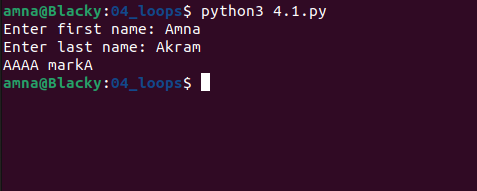

# Basics of Programming

## Exercises 4: Loops
* Information on how to return exercises is in course Moodle page.

### 4.1.
Make a program that asks the user for the first and last name. Print the first letter of the user's first name as many times as there are letters in the first name. Then print the user's last name in reverse order.
For example, if the user gives the first name '*Cherry*' and the surname '*Kernell*' the output would be:

Example output:

    Enter first name: Cherry
    Enter last name: Kernell
    CCCCCC llenreK

### 4.2.

Make a function **lottery()**, which draws the 7 random numbers of the lottery line in range 1-40. Verify that one lottery line does not include same number multiple times. Ask user how many lottery number sets to generate and print them to the console.
To generate random numbers, use Pythons random module, see more: https://www.w3schools.com/python/gloss_python_random_number.asp

Example output:

     How many sets of lottery numbers to generate: 3
     2,7,12,19,27,33,38
     3,8,13,29,28,35,39
     4,9,14,21,29,37,40

