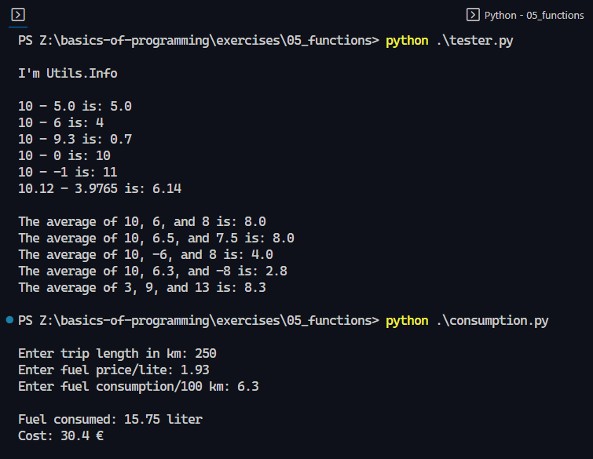

# Basics of Programming

## Exercises 5: Functions

### 5.1.
Create new source file '*utils.py*'.
Implement function **show_info**, which prints into the console "*I'm Utils.Info*"
Create another new source file '*tester.py*', where you call function **show_info**. Verify that output of the **show_info** is printed to the console.

### 5.2.
Add function **subtract** into the '*utils.py*' file. **subtract** function takes two parameters and should return a subtraction of the given two parameters.

Add another function **average** into the '*utils.py*' file. **average** function takes three parametes and should return average of the given parameters in precision of one decimal place.

Test these new functions with varying parameters and verify that they return correct values.

### 5.3.
Add function **calc_consumption** into the '*utils.py*' file. **calc_consumption** takes parameters:
* Vehicle fuel consumption as liters per 100km
* Cost of fuel per liter
* Traveled distance in kilometres.

The **calc_consumption** function prints to the console how many liters of fuel have been used on the way, as well as the amount of money spent on fuel.
Create a file '*consumption.py*' asking the user: consumption, fuel price and distance traveled. Then call the **calc_consumption** function from the program. Check that the function calculates consumption and fuel price correctly.

Example output:

    Enter trip length in km: 150
    Enter fuel price/liter: 1.67
    Enter fuel consumption/100 km: 4.2
    Fuel consumed: 6.30 liter
    Cost: 10.52 €
