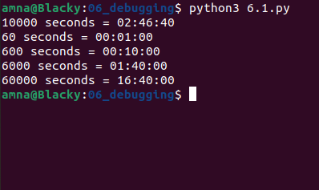
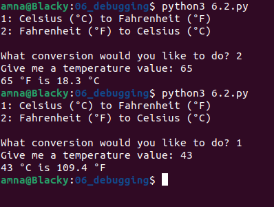

# Basics of Programming

## Exercises 6: Recap and Debugger
* Information on how to return exercises is in course Moodle page.

### 6.1.
Make a function **time** that converts seconds (sent as parameter) into text form of hours:minutes:seconds. For example, for the number 10000, the following text is returned: "02:46:40"

Test the functionality of your program with at least five different values.

### 6.2.
Create functions: **cel_2_fah** ja **fah_2_cel**
Functions take a temperature degree as parameter and convert it to between Fahrenheit and Celsius. The converted temperature value is returned to one decimal place.
Test each function by calling it with the numbers provided by the user.

For example: **print(cel_2_fah(10.0))** returns value *50.0*

### 6.3.
Make a program that asks for the names of the students until the user provides a blank input. The program then tells you how many names were given and displays them in a single line separated by commas.

NOTE: You may need to peek ahead to 'Collections' lesson and check out how to use list to make this work.

Example output:

    Enter student name:Minna
    Enter student name:Matti
    Enter student name:Kirsi
    Enter student name:Arto
    Enter student name:
    Student count: 4
    Minna, Matti, Kirsi, Arto

### 6.4.
Five judges are used in the ski jumping. Write a program that asks for rating points for one jump and prints the sum of the style points with the minimum and maximum style points deducted from the sum.

Example output:

    Give points from judge 1: 19
    Give points from judge 2: 20
    Give points from judge 3: 18
    Give points from judge 4: 16
    Give points from judge 5: 20
    Total points are: 57
