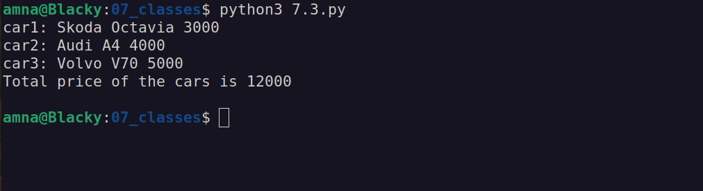

# Basics of Programming

## Exercises 7: Classes and Objects

### 7.1.
Declare a class **Human**. Class has two properties, *name* and *age*. Implement **Human**-class:
Constructor initializes **Human**-object name and age thru its parameters.
Override **Human** class **__str__** function to print object information.

Declare two **Human** class objects. Initialize them with data that produces the example output:

Example output:
    
    Name: Adam, Age: 18  
    Name: Eva, Age: 18  

### 7.2.
Declare a class **Cat**. Implement two properties, *name* and *color*, and a function **meow**. Declare two **Cat** objects with following information:
    
    name: Kit, color: black  
    name: Kat, color: white

When Cat meows, it sais *Meoooooow!* (print that to the console in **meow** function).

Print Cat objects info to the console and make them meow:

Example output:

    Kit, Color: black
    Kat, Color: white
    Kit says: Meoooooow!
    Kat says: Meoooooow!

### 7.3.
You have three cars in your garage. Declare a class **Car**. **Car** has three properties; *brand*, *model* and *price*. Create at least three different car objects. Set the properties like this:
1) brand="Skoda" model="Octavia" price=3000
2) brand="Audi" model="A4" price=4000
3) brand="Volvo" model="V70" price=5000

Print information of all cars into the console. In addition, calculate the combined price of all cars and print that into the console.

Example output:

    car1: Skoda Octavia 3000
    car2: Audi A4 4000
    car3: Volvo V70 5000
    Total price of the cars is 12000

Next, create at least five random car objects from these brands: 'Audi', 'BMW', 'Ford', 'Opel', 'Skoda', 'Volvo' ja 'VW'. Cars *model* property can be left empty if you wish. Generate a random price for each car in range 1000-10000. Add created cars into a list-collection.

Print information of all cars into the console. Tip: use Python **randint**-function to implement random numbers.

